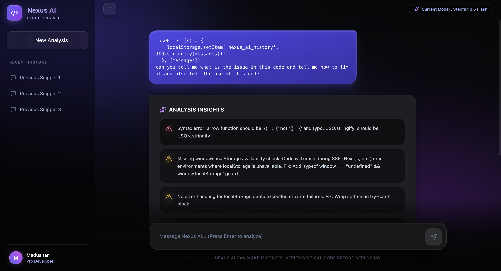
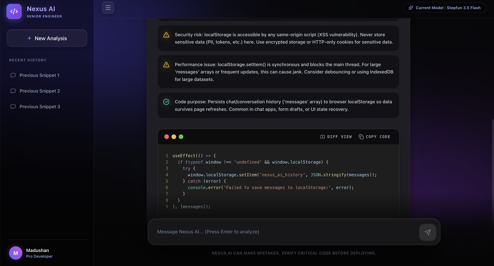

# Nexus AI - Senior Engineer Code Assistant

Nexus AI is a highly opinionated, brutally honest AI Code Assistant designed to act as a *Senior Principal Software Engineer*. Instead of generic chatbot responses, Nexus AI forces language models to analyze your code and return a rigid, actionable JSON payload containing refactored snippets and key insights.

## 🚀 Features
- **Cinematic 3D UI**: Built with Framer Motion, Tailwind CSS, and advanced CSS glassmorphism for a deeply engaging, physical developer experience.
- **RAG + Memory System**: The first conversational code assistant that actually *remembers*. It uses a local SQLite database and a Retrieval-Augmented Generation (RAG) layer to inject expert coding patterns into every analysis.
- **Mobile Responsive Perfection**: Fully optimized for mobile with "Viewport Locking"—the layout is locked to your screen width while allowing independent horizontal scrolling for code blocks. No more horizontal page overflow.
- **Multi-File Drag & Drop Context**: Seamlessly drag and drop multiple source files directly onto the application UI to instantly extract their content and feed the AI deep architectural context.
- **Side-by-Side Visual Diff Viewer**: Toggle button strictly integrated with `react-diff-viewer-continued`, allowing you to instantly cross-reference optimized code against the original.
- **Expert Knowledge Base**: Automatically retrieves relevant security and performance patterns (OWASP, React Hoook best practices, SSR guards) during code analysis.
- **LocalStorage & DB Persistence**: Complete continuity via a dual-layer system (LocalStorage for UI state, SQLite for deep AI context memory).
- **Dynamic Syntax Auto-Detection**: Supports syntax highlighting for JS, Python, HTML, Rust, CSS, and more.
- **Secure Architecture**: A Node.js/Express backend proxy ensures your API keys are never exposed to the client-side.

## 🛠️ Technology Stack
- **Frontend**: React 19, Vite, Tailwind CSS, Framer Motion, Lucide React, and React-Diff-Viewer.
- **Backend**: Node.js, Express, **Better-SQLite3** (Memory & RAG), and Dotenv.
- **AI Engine**: OpenRouter API integration, utilizing high-performance models like `stepfun/step-3.5-flash:free`.

## ⚙️ Running Locally

### 1. Installation
Navigate into the `frontend` directory and install the required dependencies:
```bash
# Install frontend
npm install

# Install backend dependencies
cd backend
npm install
```

### 2. Environment Setup
Inside the `frontend/backend` directory, create a `.env` file:
```env
OPENROUTER_API_KEY=your_actual_key_here
PORT=3001
```

### 3. Start the Application
Run the following from the root `frontend` directory:
```bash
npm run dev:all
```

The application will now be running at `http://localhost:5173`.



