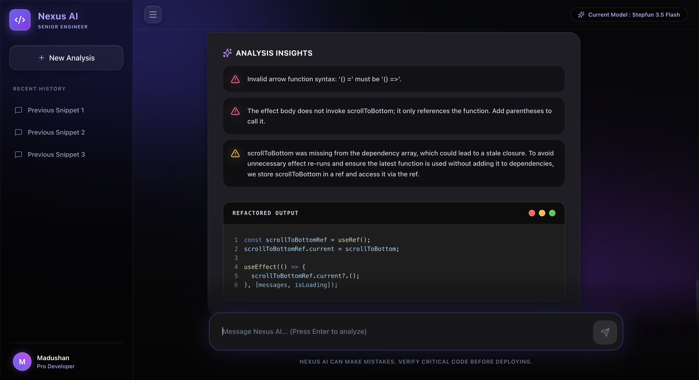

# Nexus AI - Senior Engineer Code Assistant

Nexus AI is a highly opinionated, brutally honest AI Code Assistant designed to act as a *Senior Principal Software Engineer*. Instead of generic chatbot responses, Nexus AI forces language models to analyze your code and return a rigid, actionable JSON payload containing refactored snippets and key insights.

## 🚀 Features
- **Cinematic 3D UI**: Built with Framer Motion, Tailwind CSS, and advanced CSS glassmorphism for a deeply engaging, physical developer experience.
- **Strict Code Evaluation**: Identifies bugs, architectural flaws, and performance bottlenecks, returning explanations via beautiful Lucide-React alerts.
- **Syntax Highlighting**: Natively renders refactored blocks via `react-syntax-highlighter` using a sleek `vscDarkPlus` theme.
- **Secure Architecture**: A Node.js/Express backend proxy guarantees that your precious API keys are never exposed in the browser.

## 🛠️ Technology Stack
- **Frontend**: React 19, Vite, Tailwind CSS (v3 with PostCSS), Framer Motion, and Lucide React icons.
- **Backend / API Wrapper**: Node.js, Express, Cors, and Dotenv.
- **AI Engine**: Native Node `fetch` communicating directly with the **OpenRouter API**, utilizing the extremely fast `stepfun/step-3.5-flash:free` model (Customizable to any other LLM via the code).

## ⚠️ Known Restrictions & Limitations
- **Strict JSON Parsing Constraints**: This tool acts primarily as a dedicated code analyzer. If you attempt to ask it purely conversational questions (e.g., *"How is the weather?"*), the backend JSON parser will purposely crash because it enforces a strict `{ optimizedCode: "...", analysis: [...] }` schema. It is **not** a general-purpose chat UI!
- **Stateless Analysis / No Context**: Currently, every code submission is completely stateless. The AI does not remember previous snippets or the surrounding context of your codebase unless you manually paste the entire context block into the chat.
- **Model Variability**: Because Nexus relies on generic, sometimes experimental free-tier models via OpenRouter, the generated code might contain syntax regressions. *Always verify critical logic before deploying.*

## ⚙️ Running Locally

### 1. Requirements
Ensure you have [Node.js](https://nodejs.org/) installed on your machine.

### 2. Installation
Navigate into the `frontend` directory and install the required dependencies:
```bash
git clone <your-repo>
npm install
cd backend
npm install
```

### 3. Environment Setup
Navigate into the `frontend/backend` directory and create a `.env` file for your OpenRouter key:
```bash
cd backend
touch .env
```
Inside your `.env` file, place your OpenRouter API Key and the Express port:
```env
OPENROUTER_API_KEY=your_actual_openrouter_api_key_here
PORT=3001
```
*(You can get a free API key at [OpenRouter](https://openrouter.ai/))*

### 4. Start the Application
Thanks to `concurrently`, you can boot up both the React frontend and the Express backend simultaneously with one command. From the `frontend` directory:
```bash
cd ..  # ensure you are in the frontend directory
npm run dev:all
```

The application will now be running on your local machine, typically at `http://localhost:5173`.

